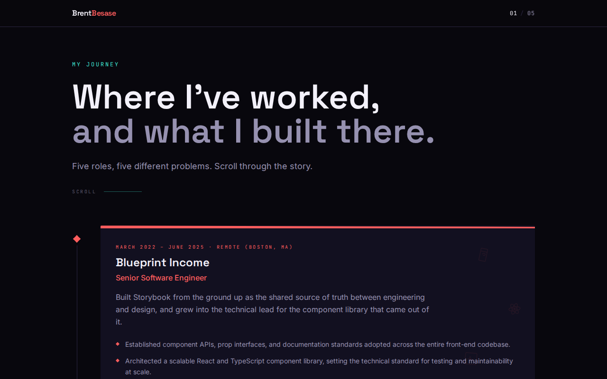
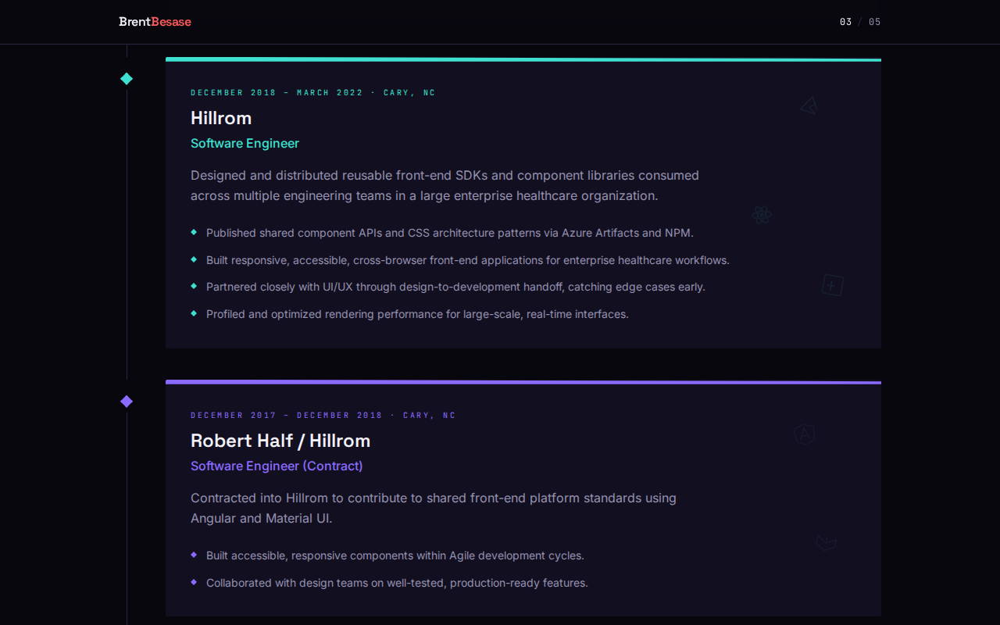
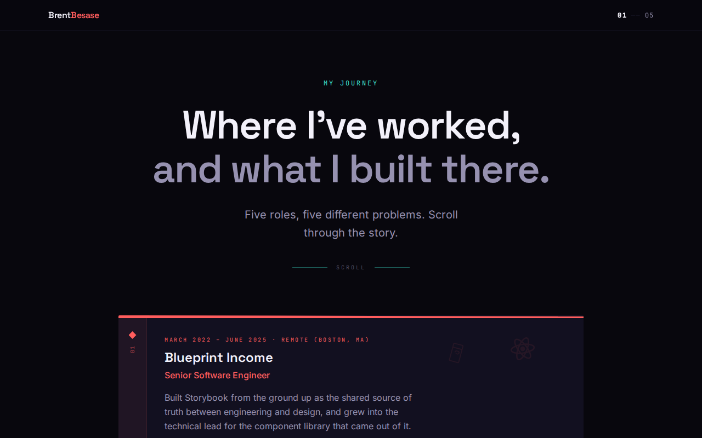
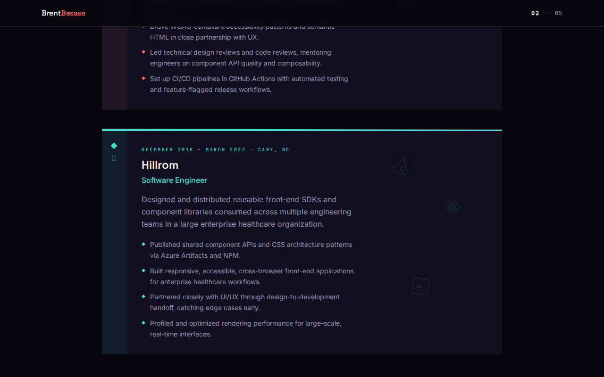
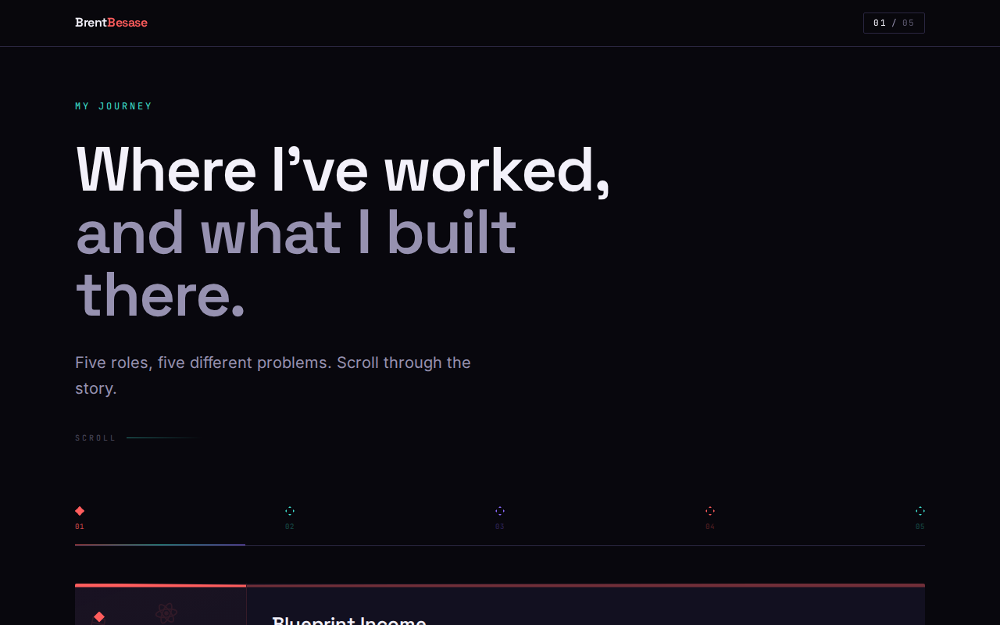
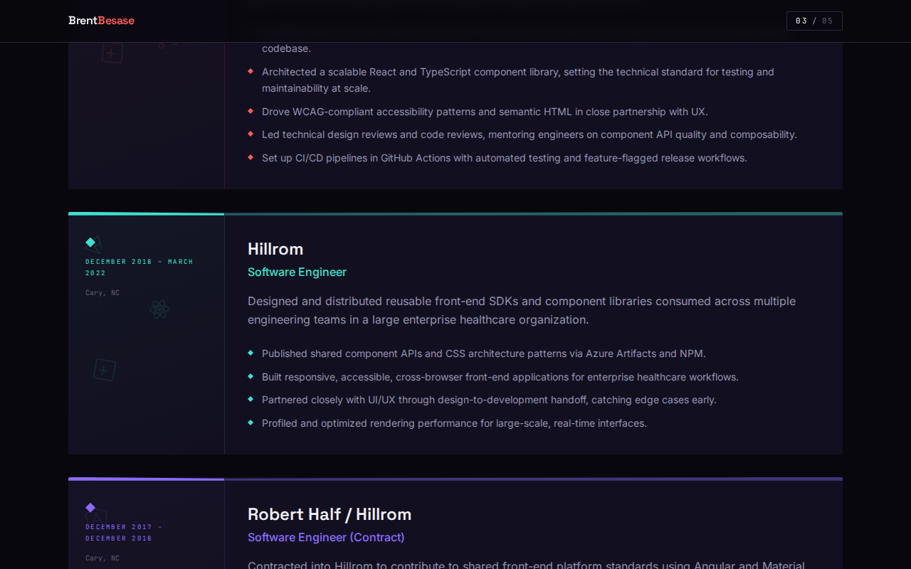
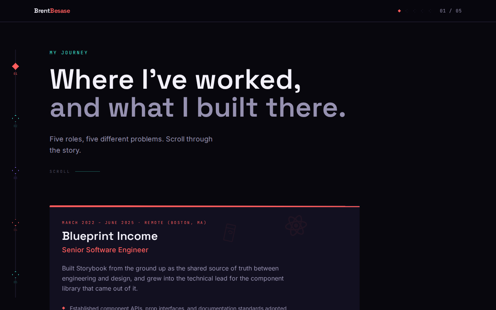
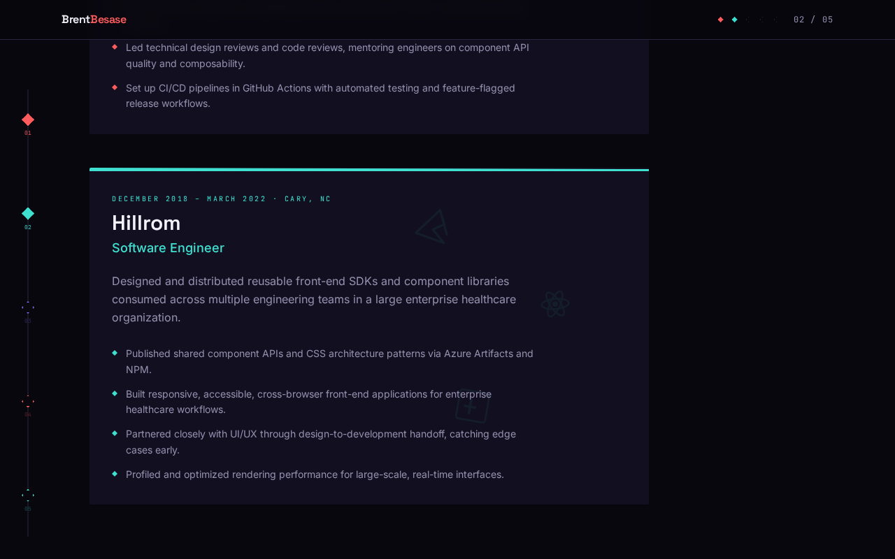
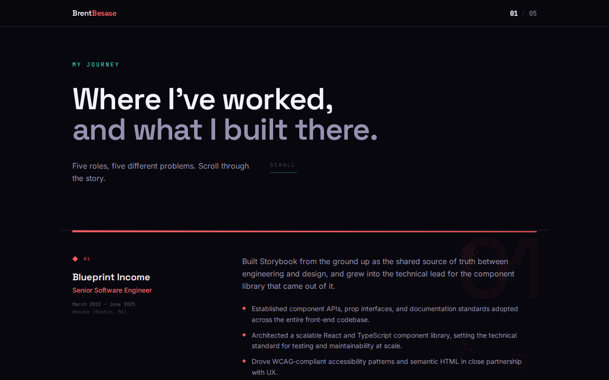
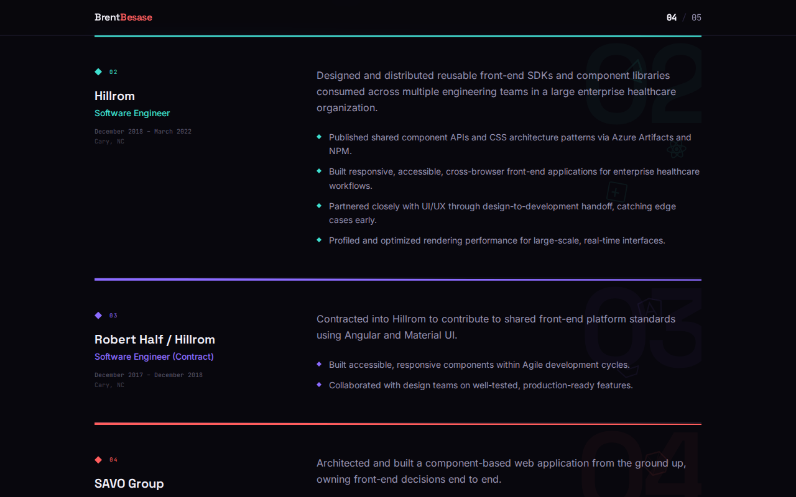

# Journey Page — Scrollytelling UI Variant Summary

## Brief

Redesign the `/journey` route into a real scrollytelling experience with three specific refinements layered on the previous winner's card structure:

1. **Diamond bullet markers** — `◆` inline SVG as list item markers for each chapter's highlights.
2. **Cinematic opening treatment** — two-line headline (first line: `paper`, second line: `mist`), a `SCROLL` prompt + horizontal accent line beneath the intro paragraph, and a persistent progress indicator `NN / 05` in the fixed header with `aria-live`.
3. **Off-center background tech collage** — per-chapter scattered low-opacity abstracted SVG icon marks evoking the named technologies (React, TypeScript, Storybook, GitHub Actions, Azure, Angular, Material UI, Node.js, JavaScript) without reproducing trademarked logo artwork.

All variants: IntersectionObserver + CSS transitions only (no new npm deps), `prefers-reduced-motion` respected via lazy state initializers (all chapters revealed immediately), accent cycling volt → cyan → violet, faceted top border on each chapter card, left-side timeline with diamond connectors.

---

## Variants

### V1 — Clarity (Score: 18 / 20)

**Fidelity 5 · Tokens 5 · Accessibility 4 · Distinctiveness 4**

Left-sidebar vertical timeline column where each row pairs a diamond marker with the chapter card to its right. Fade-in + translateY(28px→0) reveal. Tech collage placed in the top-right corner of each card at 0.07 opacity. Clean, balanced hierarchy — the strongest legibility of the five.

---

### V2 — Momentum (Score: 17 / 20)

**Fidelity 4 · Tokens 5 · Accessibility 4 · Distinctiveness 4**

Centered hero with the SCROLL prompt flanked by two accent lines. Cards are full-width with a left accent strip (tinted background + vertical number label) standing in for the timeline. Tech collage fills the right-third of each card at 0.08 opacity with larger icons — the most legible collage of all variants. Slide-up (translateY 50px→0) reveal.

---

### V3 — Structure (Score: 17 / 20)

**Fidelity 3 · Tokens 5 · Accessibility 4 · Distinctiveness 5**

2-column grid: narrow left meta column (date, location, diamond, tech collage icons) + wide right content column. Horizontal progress bar row above the chapters shows all five diamonds and a gradient fill line that advances as chapters reveal. Scale(0.97→1) + fade reveal. Docked the fidelity score because the 80px headline wraps to three lines instead of the required two-line cinematic treatment.

---

### V4 — Immersive (Score: 19 / 20) ✓ WINNER

**Fidelity 5 · Tokens 5 · Accessibility 4 · Distinctiveness 5**

Sticky left sidebar hosts the full vertical timeline: a vertical hairline with all five diamonds spaced down the height of the viewport, each filling with accent color as its chapter is revealed. The fixed header shows a mini-diamond row (one per chapter, filled vs. unfilled) alongside the `NN / 05` counter — the most considered use of the progress indicator. Cards slide in from the left (translateX(-24px→0)). Tech collage icons are the largest across all variants and spread across the full card background, making the tech visual cues the most immediately readable — azure triangle, react atom, and angular shield are all recognizable in the screenshots.

---

### V5 — Editorial (Score: 17 / 20)

**Fidelity 4 · Tokens 5 · Accessibility 4 · Distinctiveness 4**

Full-width horizontal chapter bands separated by horizontal rules with a thin faceted accent strip at the top of each. Large decorative chapter numbers (180px, 0.035 opacity) in the background give editorial depth. 2-column within each band: left for company meta + diamond, right for content. Subtle fade-up (translateY 20px→0) reveal. The SCROLL prompt splits the hero section in an awkward horizontal split with the intro paragraph. Tech collage positioned top-right at 0.07 opacity.

---

## Why V4 Won

V4 is the most considered design for this specific site and brief:

- **Sticky sidebar timeline** — The brief calls for "a left-side vertical timeline with diamond connectors that fill in as each chapter is revealed." V4 implements this as a true persistent sidebar, visible across the entire scroll, so the fill-in effect reads as an ongoing narrative arc rather than a per-card decoration.
- **Progress indicator integration** — The header's mini diamond row (one per chapter, filling in with the chapter's accent color) is a design-system-native treatment that mirrors the sidebar's language and avoids a generic counter widget.
- **Tech collage impact** — Larger icon sizes (52–72px vs. 28–36px in other variants) at 0.06 opacity make the tech marks the most recognizable at a glance without competing with the text.
- **Motion-direction distinctiveness** — The translateX(-24px→0) slide direction is unique among the five and feels appropriate for a chapter "arriving" from the left side where the timeline lives.
- All required accessibility attributes present: `aria-live="polite"` on progress counter, `aria-hidden="true"` on all decorative SVGs, semantic section headings with `aria-labelledby`, and lazy `useState` initializers ensure content is fully visible under `prefers-reduced-motion` with no stuck-mid-transition elements.
